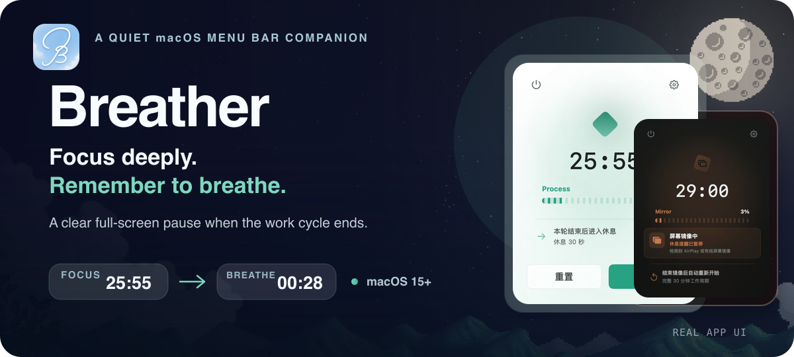

<p align="center">
  
</p>

<p align="center">
  <a href="README.md"><strong>English</strong></a> · <a href="README.zh-CN.md">简体中文</a>
  <br><br>
  <a href="https://github.com/M3tar/Breather/releases/latest"><strong>Download the latest Breather DMG</strong></a>
</p>

Breather is a quiet macOS menu bar companion for people who can focus deeply—and sometimes forget to stop. It keeps the work timer close, then turns break time into a clear full-screen pause across every connected display.

## See your rhythm

The menu bar popover keeps the current stage, remaining time, and next action together. A manual pause or mirrored display preserves the active timer instead of silently resetting it.

<p align="center">
  
  
  
</p>

## Step away from the screen

When a cycle ends, Breather replaces another dismissible notification with an intentional visual pause. Choose a calm background, a short prompt, and how much information you want to keep on screen.


### New rest themes · 0.2.1

The features below are included in Breather 0.2.1 and are not available in the 0.2.0 installer. Download the matching installer from Releases or build from source; see each Release's notes for the features included in that download.

- **A Moment of Quiet (此刻留白)** — Set the busy day down and keep this moment for yourself. Solid, translucent, moon, and sun backgrounds keep the countdown and prompts at the center.
- **Pixel Roam (像素漫游)** — Small footsteps, with nowhere to rush. A sage-green dinosaur walks and hops over cacti automatically, accompanied by pale green clouds and mint accents. No controls, scores, or failure states.

<p align="center">
  
  
</p>

The animation keeps its own pace regardless of break duration, while the countdown stays central. Displays with enough space animate together and share the countdown and prompts. Reduce Motion or limited space switches the character to a static presentation. This is quiet company for a break—not something to keep watching or a replacement for looking away from the screen.

Choose a theme under the rest-screen settings. Static cards reflect the configured duration and main prompt; A Moment of Quiet also reflects the selected background. One page-level preview button stays at the bottom, with separate sound auditions. Previewing does not change the work timer and ends automatically or when closed. Previews are unavailable during a real break; theme changes made then apply to the next break.


These three images are offscreen renders of the current SwiftUI components, not full-window screenshots. They show the actual interface content but do not demonstrate motion. English theme names above are descriptive translations of the Chinese labels shown in the app.

## A natural cycle, not a productivity contest

1. **Focus quietly.** A configurable timer stays in the menu bar while you work.
2. **Breathe clearly.** Every connected display enters the same full-screen rest countdown.
3. **Return naturally.** Breather starts the next cycle without scores, streaks, or pressure.

Breather also understands some of the interruptions around real work: idle time can count as a completed rest, missed breaks can produce a later recovery nudge, and AirPlay or wired display mirroring can pause the timer automatically.

### The essentials

- Start, pause, reset, or begin a break directly from the menu bar.
- Configure work time, short breaks, pre-break notices, snooze, and skip behavior.
- Pick a solid, moon, or sun rest background and separate sounds for each stage.
- Choose light, dark, or system appearance, progress style, theme color, and menu bar icon.
- Apply schedule changes now or safely defer them until the next cycle.
- Optionally launch at login and protect active timers during display mirroring.

## Native settings, kept calm

General, schedule, and rest-screen settings use native macOS controls and keep related choices together. You can preview the rest screen before it interrupts a real work cycle.


<p align="center">
  
  
</p>

## Download and install

Breather requires **macOS 15 or later**. The universal DMG supports both Apple silicon and Intel Macs.

1. Download the latest DMG from [GitHub Releases](https://github.com/M3tar/Breather/releases).
2. Open it and drag **Breather** into **Applications**.
3. Launch Breather from Applications.

> [!IMPORTANT]
> Breather is an early pre-release and is not yet signed with an Apple Developer ID or notarized by Apple. Install only a build downloaded from this repository.

If macOS blocks the first launch, try opening Breather once, then go to **System Settings → Privacy & Security → Security** and choose **Open Anyway**. Apple keeps this option available for roughly one hour after the blocked attempt. See [Apple's guidance](https://support.apple.com/guide/mac-help/open-a-mac-app-from-an-unknown-developer-mh40616/mac) for details.

## Known boundary

Display mirroring protection covers **AirPlay mirroring and wired mirrored displays**. Breather does not currently detect software-only screen sharing inside meeting apps. Several approaches were explored, but none proved reliable enough, so automatic pausing for meeting-app screen sharing is on hold for now.

Pixel Roam in 0.2.1 has been checked with both displays animating. A brief hitch during display connection or disconnection remains a performance observation for follow-up. Static images are not evidence of frame rate or energy use.

## Project structure

This README is shared by the internal repository and the public GitHub repository. The directory tree below shows only the content copied to the public GitHub snapshot; it is not the complete structure of the internal repository.

The internal repository additionally contains the following directories, which are intentionally excluded from GitHub:

- `Tests/BreatherTests/` — automated regression tests;
- `planning/` — product requirements, design decisions, verification records, and release plans;
- `notes/` — development guides and internal workflow notes.

```text
Breather/
├── Breather.xcodeproj/          Xcode project and app targets
├── Package.swift                Swift Package executable and test target
├── Sources/Breather/
│   ├── App/                     App lifecycle and entry points
│   ├── Core/                    Settings, break rules, and scheduling
│   ├── Features/
│   │   ├── MenuBar/             Timer popover and menu bar controller
│   │   ├── RestOverlay/         Full-screen rest view and windows
│   │   └── Settings/            General, schedule, and overlay settings
│   ├── System/                  Idle, mirroring, notifications, sounds, login
│   └── Resources/               App icons, backgrounds, and sound files
├── scripts/                     DMG build and local registration cleanup tools
├── assets/readme/               README visual assets
└── screenshots/                 Product screenshots and labeled component renders
```

The scheduler and settings model live in `Core`; macOS integrations stay in `System`; interface code is grouped by feature. This keeps time rules testable without pulling window or menu bar behavior into the same layer.

## Build from source

Clone the repository, open `Breather.xcodeproj`, select the **Breather** scheme, and press `Command + R`:

```sh
git clone git@github.com:M3tar/Breather.git
cd Breather
open Breather.xcodeproj
```

Xcode Debug builds use the display name **Breather Debug** and bundle identifier `com.mercury.breather.debug`. Installed releases use `com.mercury.breather`, so their settings and notification permissions remain independent.

You can also start the Swift Package executable with:

```sh
swift run Breather
```

<details>
<summary><strong>Command-line build and DMG tooling</strong></summary>

Build the Xcode project from the command line:

```sh
xcodebuild \
  -project Breather.xcodeproj \
  -scheme Breather \
  -configuration Debug \
  -derivedDataPath build/DerivedData \
  CLANG_MODULE_CACHE_PATH=build/ModuleCache \
  build
```

Create a compressed release DMG:

```sh
./scripts/build-dmg.sh 0.2.0
```

The artifact is written to `dist/Breather-0.2.0.dmg`. On a development Mac with stale release registrations, inspect and repair LaunchServices with:

```sh
./scripts/reset-local-release-registration.sh --dry-run
./scripts/reset-local-release-registration.sh --apply
```

The repair tool only changes LaunchServices registration; it never deletes an app or its settings.

</details>

## Releases

- **[0.2.1](https://github.com/M3tar/Breather/releases/tag/v0.2.1)** — A Moment of Quiet / Pixel Roam themes, a nature-toned pixel dinosaur, and synchronized multi-display animation; shared rest/preview layout and updated theme cards, thumbnails, and preview entry point.
- **[0.2.0](https://github.com/M3tar/Breather/releases/tag/v0.2.0)** — Native settings redesign, display-mirroring protection, clearer pause states, safer next-cycle settings, and more reliable notifications.
- **[0.1.0](https://github.com/M3tar/Breather/releases/tag/v0.1.0)** — Initial public preview with the complete timer and full-screen rest experience.

Breather is under active development. Interfaces, settings, and distribution details may change before 1.0.

## License

Breather source code is available under the [MIT License](LICENSE). The original Breather icons were created by M3tar. Copyright in the included sound effects and background images remains with their respective rights holders; those assets are not covered by the source-code license.
