<p align="center">
  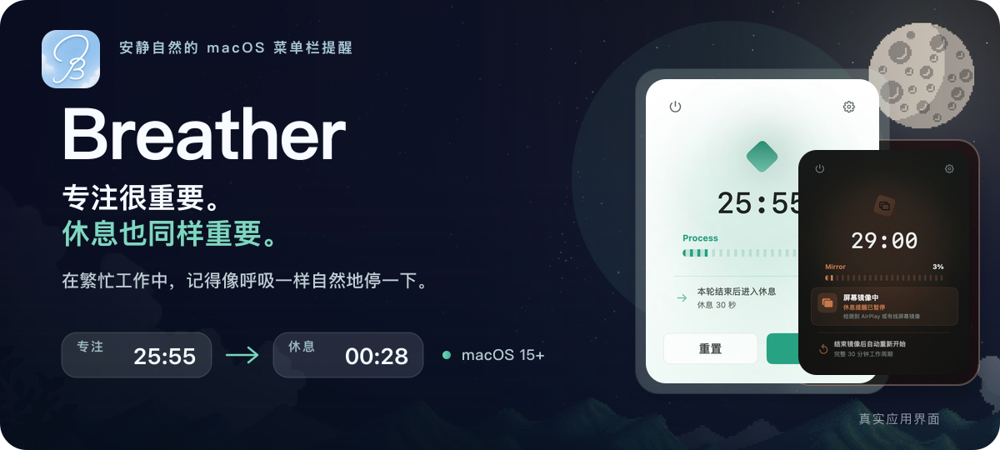
</p>

<p align="center">
  <a href="README.md">English</a> · <a href="README.zh-CN.md"><strong>简体中文</strong></a>
  <br><br>
  <a href="https://github.com/M3tar/Breather/releases/latest"><strong>下载最新版 Breather DMG</strong></a>
</p>

我做了一个提醒自己停一停的 macOS 小工具。做东西时，我常常一坐就是很久；明明知道该休息，提醒弹出来，手还是会顺势把它划掉。

于是有了 Breather。它平时安静地待在菜单栏里；到时间了，就在每台显示器上给休息留一小段时间。站起来、喝口水、看看远处，回来再继续。

## 工作节奏，一眼看清

菜单栏弹窗集中展示当前阶段、剩余时间和下一步操作。无论手动暂停还是进入显示器镜像，当前工作计时都会被保留，而不是在后台悄悄重置。

有时换一种颜色，也能换一种心情。弹窗主题色和菜单栏图标都可以挑选；它每天待在屏幕一角，选一个看着舒服的就好。

<p align="center">
  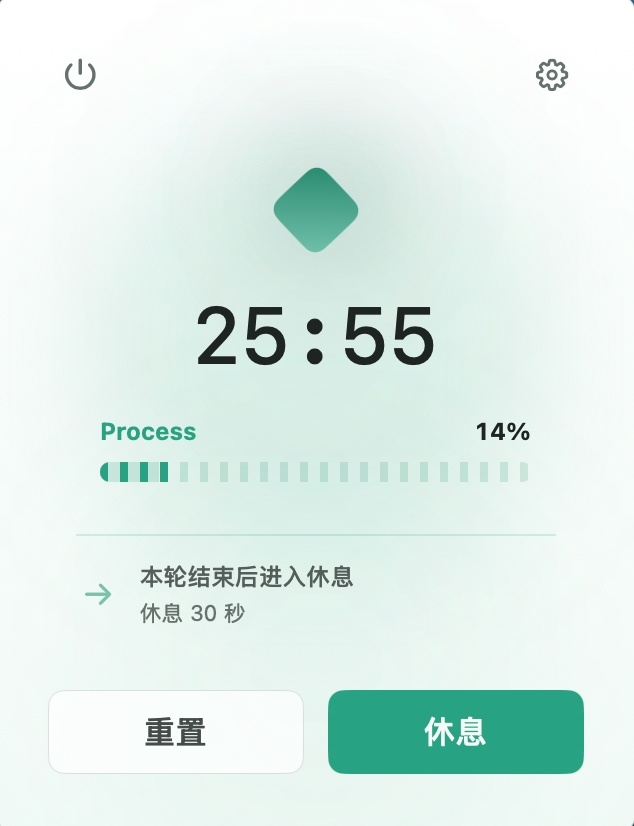
  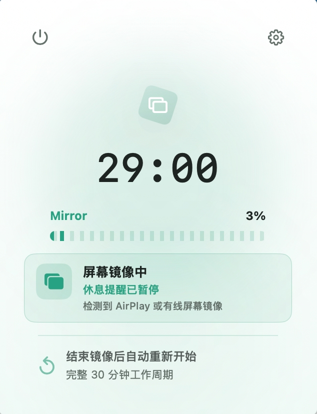
  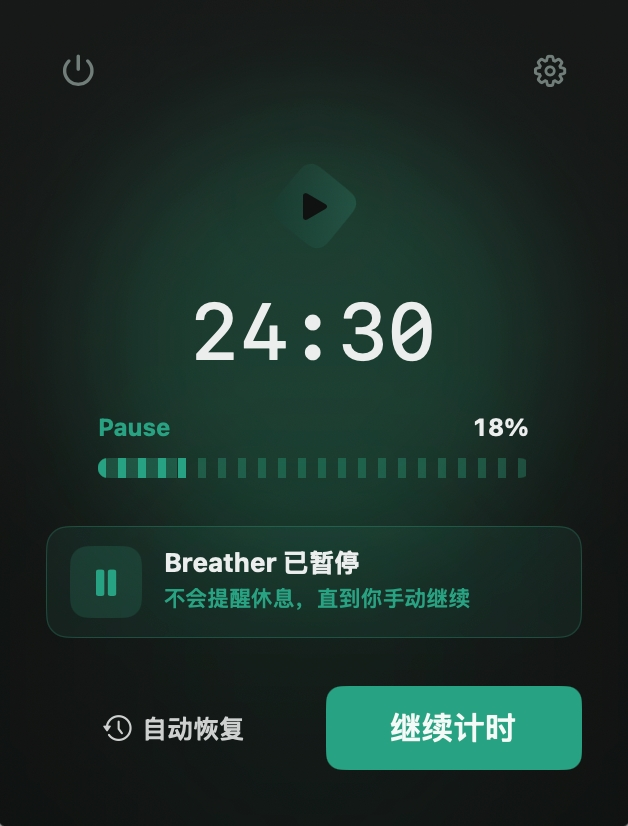
</p>

## 到时间，就真正离开屏幕

一个周期结束后，Breather 不会再递上一条随手就能忽略的通知，而是创造一次明确的视觉停顿。你可以选择安静的背景、简短的提示语，以及希望在屏幕上保留多少信息。

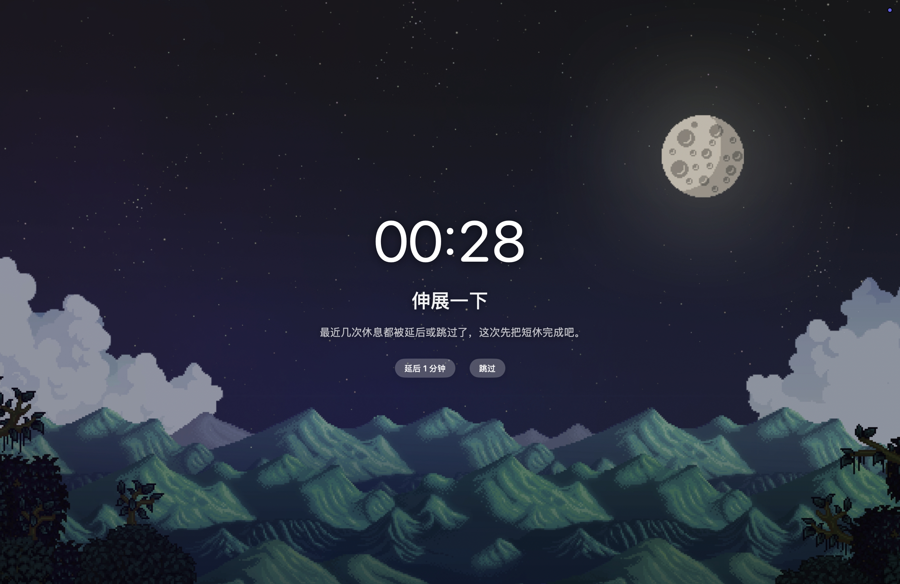

### 休息主题 · 0.3.0

做这些画面时，我把喜欢的日常也放了进去：游戏里的小恐龙、睡前的窗帘、夜里吹进来的风、闭眼也能听见的雨，还有一列想去远方的火车。它们慢慢变成了九种休息主题。

- **此刻留白** — 最早的一版，想做得简单、克制一点。里面也留着我喜欢《星露谷物语》时的心情：忙完以后，幸好还有一个地方可以歇一歇。纯色、半透明、月亮与太阳背景都能让倒计时和提示语留在画面中心。
- **像素漫游** — 我一直喜欢 Chrome 的小恐龙，连浏览器主题都换成了它。为了让它住进 Breather，还特意把它调成了绿色。它会自动漫步、跳过仙人掌，没有分数，也不会失败。

<p align="center">
  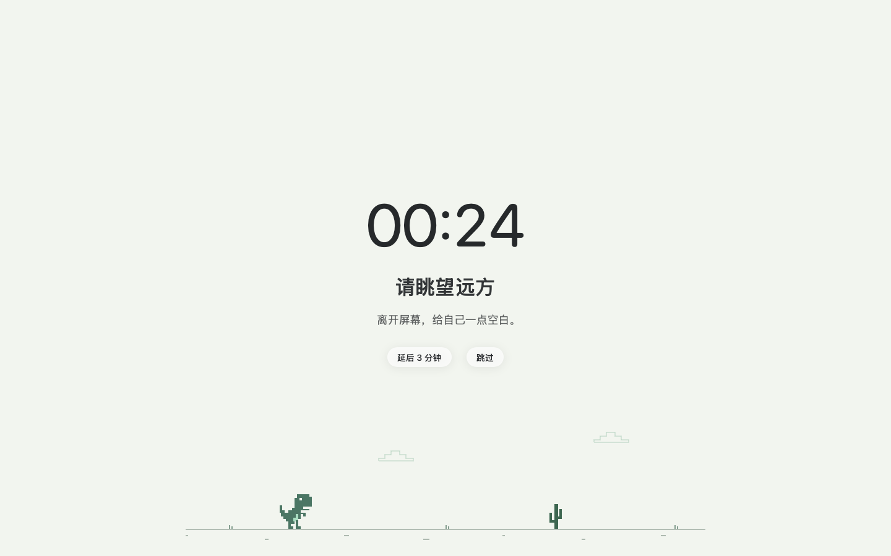
  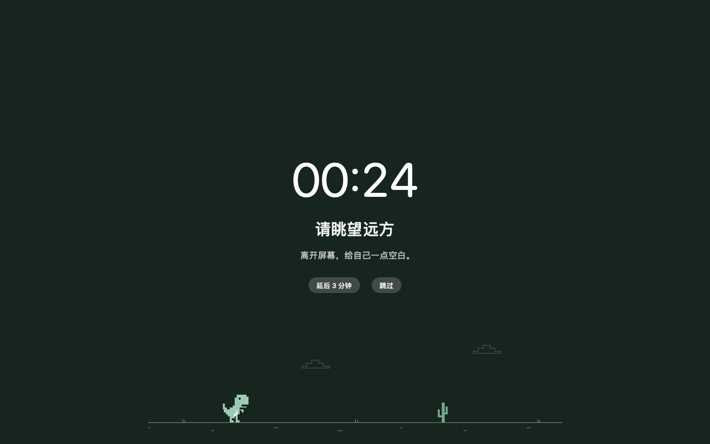
</p>

动画节奏独立于休息时长，倒计时仍在中央。空间充足的显示器共同播放动画并共享倒计时与提示；开启系统“减少动态效果”或空间不足时使用静态角色。它是休息时的轻陪伴，不需要盯着看，也不能代替离开屏幕、眺望远处。

- **幕间休息** — 某晚睡前拉窗帘时想到：窗帘的开合，很像舞台的开幕与谢幕。工作和休息，也可以有这样一个轻轻的转场；主题提供四种配色。
- **月夜静栖** — 从最初融入《星露谷物语》截图的休息画面简化而来。设计时正好临近中秋，想到团圆，就想在天空挂一轮圆圆的月亮。
- **窗边叶影 / 晴日叶舞** — 做 Breather 的许多夜晚，我会把窗打开。微风吹过树叶，在墙上留下影子；夜晚的窗边和晴朗的白天，仿佛吹着同一阵风。
- **窗前听雨** — 有时休息，我会闭上眼睛。所以除了雨景，也为这个主题加入持续的雨声；不用看屏幕，也能听着雨慢慢放松。
- **雪落无声** — 有晴天、雨天，也该有雪天。看雪安静地落下，让自己也慢慢平静下来。特别感谢 beining 同学提供背景图；他旅行回来分享的视频里，沙漠下雪的画面给了我灵感。
- **云海列车** — 列车从云海驶过，像动漫里的远行一样自由。看着它慢慢向前，会觉得远方还在。愿我们一直保有一点出发的勇气，也一直年轻。

<p align="center">
  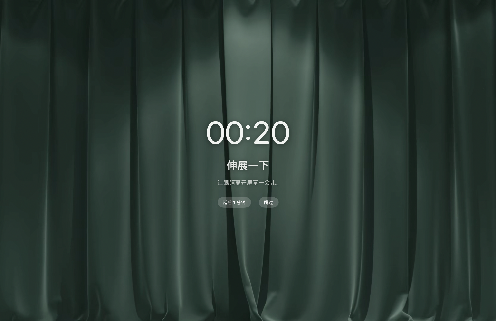
  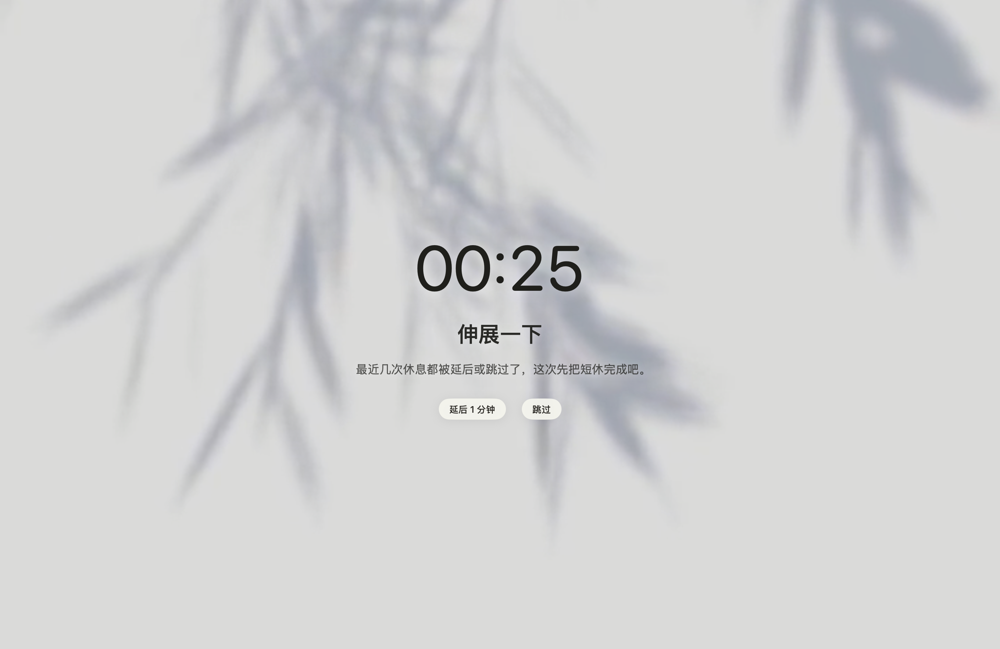
</p>

幕间休息与窗边叶影的休息界面。静态截图无法展示帷幕和叶影的动态效果。

在“休息界面 → 休息主题”选择主题，卡片静态展示当前时长和主提示语；“此刻留白”也会展示所选背景。页面底部保留统一的“预览界面”入口，声音可单独试听。预览不影响工作计时，可提前关闭或到时自动结束；真实休息进行中不能另开预览，更改主题会用于下次休息。

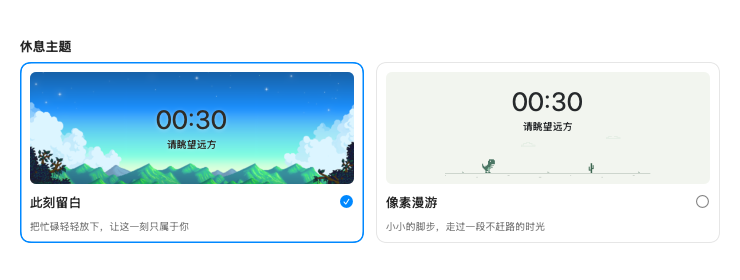

像素漫游的两张图片和上方主题卡片图由当前 SwiftUI 组件离屏渲染，展示实际界面内容，不是整窗截图；静态图片不演示动画。

## 自然循环，而不是效率竞赛

1. **安静专注。** 可调整的计时器在菜单栏里陪你工作。
2. **清楚休息。** 每一台显示器同步进入全屏休息倒计时。
3. **自然回来。** 不用追逐分数或连续纪录，准备好后再开始下个周期。

Breather 也会理解真实工作中的一些打断：离开电脑的空闲时间可以算作已完成休息；错过休息后可以稍晚提醒补休；使用 AirPlay 或有线显示器镜像时，也可以自动暂停当前计时。

### 核心功能

- 直接从菜单栏开始、暂停、重置计时，或立即进入休息。
- 调整工作时长、短休息、休息前通知、延后和跳过行为。
- 在九种休息主题中选择画面，并为不同阶段设置声音。
- 自定义浅色、深色或跟随系统外观、进度样式、主题色与菜单栏图标。
- 计划设置可以立即应用，也可以安全地留到下个周期生效。
- 支持登录时启动，以及显示器镜像期间的计时保护。

## 原生设置，保持安静

“通用 / 计划 / 休息界面 / 关于”使用 macOS 原生控件，并把相互关联的选项放在一起。你还可以先预览休息界面，再决定是否用于真实的工作周期。

如果你也常常忘了停下来，欢迎把 Breather 带走。它还在慢慢长大；哪里让你觉得舒服，或者哪里打扰了你，都欢迎通过「关于」页的邮件或 GitHub 反馈入口告诉我。那里也可以查看安装版本、检查 GitHub 上是否有新版本，或去 GitHub 为项目点星标。

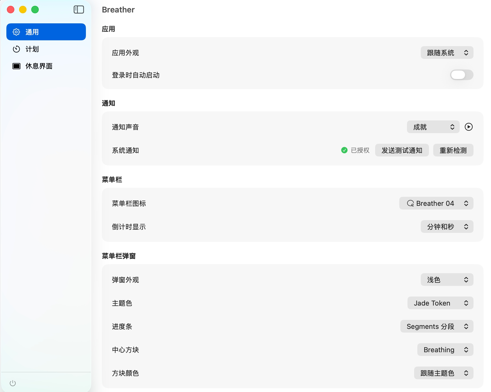

<p align="center">
  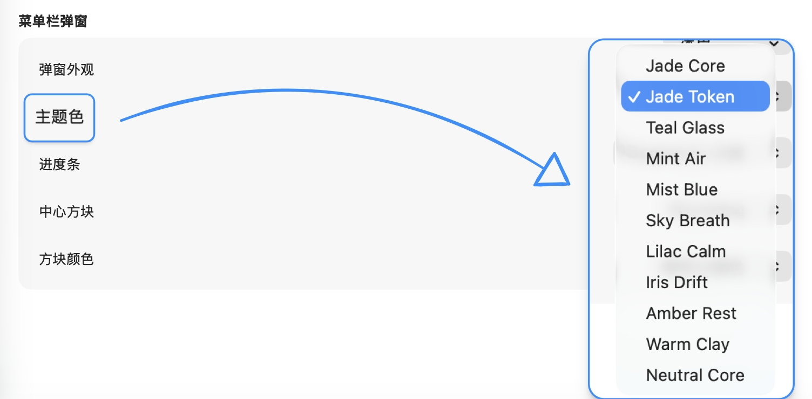
  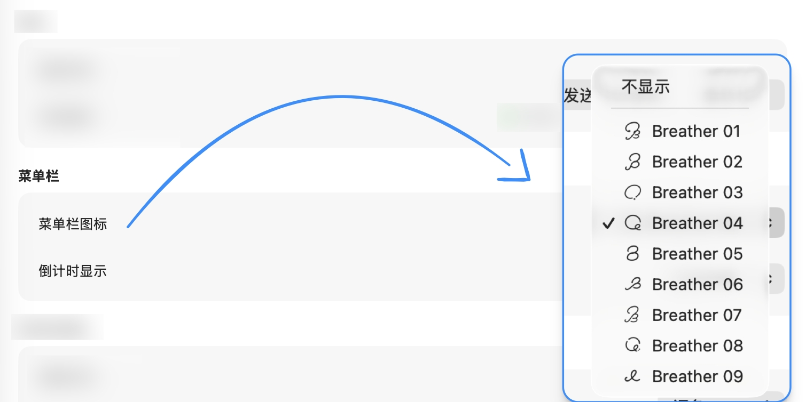
</p>

## 下载与安装

Breather 需要 **macOS 15 或更高版本**。通用 DMG 同时支持 Apple 芯片和 Intel Mac。

1. 前往 [GitHub Releases](https://github.com/M3tar/Breather/releases) 下载最新 DMG。
2. 打开 DMG，将 **Breather** 拖入 **Applications（应用程序）**。
3. 从应用程序文件夹启动 Breather。

安装后可随时在「关于 → 检查更新」手动检查。Breather 运行时还会在后台检查，每 24 小时最多一次。有新版本时，菜单栏弹窗的设置齿轮旁会出现随弹窗主题色变化的下载图标，设置侧边栏的「关于」会出现「更新」标记。点击图标或「前往 GitHub 下载」会打开对应版本的 Release 页面；在那里下载 DMG，打开后将新版本拖入应用程序文件夹即可更新。

> [!IMPORTANT]
> Breather 目前仍是早期预览版本，尚未使用 Apple Developer ID 签名，也未通过 Apple 公证。请只安装从本仓库下载的版本。

如果 macOS 阻止第一次启动，请先尝试打开一次 Breather，然后进入 **系统设置 → 隐私与安全性 → 安全性**，点击 **仍要打开**。这个选项通常会在应用被阻止后保留约一小时。详情可查看 [Apple 的相关说明](https://support.apple.com/zh-cn/guide/mac-help/open-a-mac-app-from-an-unknown-developer-mh40616/mac)。

## 当前边界

显示器镜像保护支持 **AirPlay 镜像和有线显示器镜像**。Breather 目前无法识别会议软件内部的软件共享屏幕。项目尝试过多种方案，但都无法达到足够可靠的效果，因此“识别会议共享投屏后自动暂停”功能暂时搁置。

像素漫游已完成双屏动画验证；显示器插拔瞬间仍可能短暂停顿，作为后续性能观察项保留。静态配图不代表帧率或能耗测试结果。

## 项目结构

内网仓库和 GitHub 公开仓库共用这份 README。下面的目录树只展示同步到 GitHub 的公开内容，并不是内网仓库的完整目录结构。

内网仓库还包含以下目录，它们会保留在内网，不会同步到 GitHub：

- `Tests/BreatherTests/`：自动化回归测试；
- `planning/`：产品需求、设计决策、验收记录与发布计划；
- `notes/`：开发指南与内部流程记录。

```text
Breather/
├── Breather.xcodeproj/          Xcode 工程与应用 Target
├── Package.swift                Swift Package 可执行目标与测试目标
├── Sources/Breather/
│   ├── App/                     应用生命周期与入口
│   ├── Core/                    设置、休息规则与计时调度
│   ├── Features/
│   │   ├── MenuBar/             计时弹窗与菜单栏控制器
│   │   ├── RestOverlay/         全屏休息界面与窗口
│   │   └── Settings/            通用、计划与休息界面设置
│   ├── System/                  空闲、镜像、通知、声音与登录项
│   └── Resources/               应用图标、背景与声音文件
├── scripts/                     DMG 构建与本机注册清理工具
├── assets/readme/               README 视觉素材
└── screenshots/                 产品截图与标注来源的组件渲染图
```

调度器和设置模型位于 `Core`，macOS 系统集成集中在 `System`，界面代码按功能拆分。这样可以单独测试时间规则，而不必把窗口或菜单栏行为混入同一层。

## 从源码构建

克隆仓库并打开 `Breather.xcodeproj`，在 Xcode 中选择 **Breather** Scheme，然后按 `Command + R`：

```sh
git clone git@github.com:M3tar/Breather.git
cd Breather
open Breather.xcodeproj
```

Xcode Debug 构建使用独立名称 **Breather Debug** 和 Bundle ID `com.mercury.breather.debug`；安装版使用 `com.mercury.breather`。两者的设置和通知权限相互独立，这是预期行为。

也可以直接运行 Swift Package 可执行目标：

```sh
swift run Breather
```

<details>
<summary><strong>命令行构建与 DMG 工具</strong></summary>

使用命令行构建 Xcode 工程：

```sh
xcodebuild \
  -project Breather.xcodeproj \
  -scheme Breather \
  -configuration Debug \
  -derivedDataPath build/DerivedData \
  CLANG_MODULE_CACHE_PATH=build/ModuleCache \
  build
```

生成压缩的发布 DMG：

```sh
./scripts/build-dmg.sh 0.4.0
```

安装包会写入 `dist/Breather-0.4.0.dmg`。如果开发机积累了旧的发布版注册记录，可以检查并修复 LaunchServices：

```sh
./scripts/reset-local-release-registration.sh --dry-run
./scripts/reset-local-release-registration.sh --apply
```

修复工具只会修改 LaunchServices 注册，不会删除应用或设置。

</details>

## 版本记录

- **[0.4.0](https://github.com/M3tar/Breather/releases/tag/v0.4.0)** — 后台检查新版本，在菜单栏和设置中轻量提示；休息主题增加更清晰的动态标记。
- **[0.3.0](https://github.com/M3tar/Breather/releases/tag/v0.3.0)** — 汇集九种休息主题，完善多显示器与预览体验；新增“关于”页、邮件与 GitHub 反馈入口。
- **[0.2.0](https://github.com/M3tar/Breather/releases/tag/v0.2.0)** — 原生设置界面重构、显示器镜像保护、更清晰的暂停状态、更安全的下周期设置，以及更可靠的通知。
- **[0.1.0](https://github.com/M3tar/Breather/releases/tag/v0.1.0)** — 首个公开预览版，包含完整计时与全屏休息体验。

Breather 仍在持续开发中。在 1.0 版本之前，界面、设置和分发方式都可能发生变化。

## 许可证

Breather 源代码采用 [MIT License](LICENSE) 开源。Breather 原创图标由 M3tar 绘制；内置声音与背景图片的版权归各自权利人所有，这些素材不适用于源代码所采用的许可证。

例外：`RainGlassMetalBackdrop.swift` 中的 Heartfelt 雨滴几何改编自 Martijn Steinrucken / BigWings 于 2017 年创作的 [Heartfelt](https://www.shadertoy.com/view/ltffzl)，适用 [CC BY-NC-SA 3.0](https://creativecommons.org/licenses/by-nc-sa/3.0/)，不属于 MIT 授权，依该许可不可用于商业用途。Metal 移植及蓝灰色背景属于修改；原 Shadertoy 的背景图片未收录。

`SnowfallMetalBackdrop.swift` 中的雪花几何是 Andrew Baldwin / baldand 于 2013 年创作的 [Just snow](https://www.shadertoy.com/view/ldsGDn) 的 Metal 移植，同样适用 [CC BY-NC-SA 3.0](https://creativecommons.org/licenses/by-nc-sa/3.0/)，不属于 MIT 授权，依该许可不可用于商业用途。应用在雪景下方使用压缩后的沙漠照片，鼠标偏移固定为零。

云海列车主题 `CloudTrainMetalBackdrop.swift` 改编自 mdb 的 [Up in the Cloud Sea](https://www.shadertoy.com/view/Ndc3zl)。蓝噪声 PNG 取自 [Cloudglen Express 研究项目](https://github.com/HoytXU/cloudglen_express)。原着色器和该 PNG 属于第三方素材，不在 Breather 的 MIT 授权范围内。原着色器的 `iChannel1` 叠加纹理未收录。
